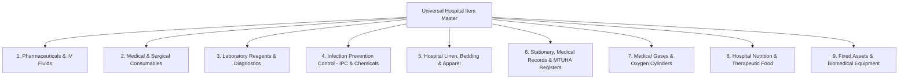
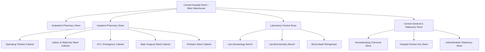
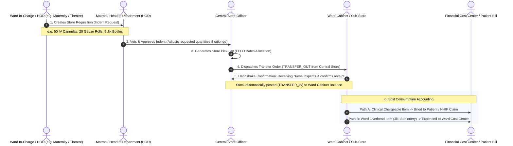

# AfyaNova V3 — Inventory, Supply Chain & Materials Management Architecture

## 1. Architectural Scope & Physical vs. Clinical Separation

AfyaNova V3 provides an enterprise-grade, multi-warehouse **Materials Management and Supply Chain System** designed specifically for the operational, regulatory, and financial realities of Tanzanian healthcare institutions (Zonal Referral Hospitals, Regional Referral Hospitals - RRH, District Hospitals - DDH/DH, Faith-Based / Mission Hospitals - CSSC, and Private Healthcare Groups).

```
┌────────────────────────────────────────────────────────────────────────────────────────┐
│                                AFYANOVA ENTERPRISE SPLIT                               │
├───────────────────────────────────────────┬────────────────────────────────────────────┤
│   INVENTORY & SUPPLY CHAIN DOMAIN         │       CLINICAL WORKSPACE DOMAINS           │
│   (App\Domains\Inventory)                 │       (Clinical, Pharmacy, Lab, Surgery)   │
├───────────────────────────────────────────┼────────────────────────────────────────────┤
│ • Universal Hospital Item Master          │ • Clinical Prescription Vetting (Allergies)│
│ • Multi-Warehouse Hierarchy & Sub-Stores  │ • Drug-Drug Interactions & Dosing Checks   │
│ • Departmental Requisitions (Store Indent)│ • Laboratory Test Bench Worklists          │
│ • Double-Entry Stock Movement Ledger      │ • Surgical Procedure & WHO Safety Checklists│
│ • FEFO Expiry & Batch Lifecycle           │ • Bedside MAR (Medication Administration)  │
│ • Procurement (MSD & DLP / Prime Vendor)  │ • Patient Invoicing & NHIF Claims Capture  │
│ • Cold Chain & DDA Narcotics Registers    │ • Medical Charting & Clinical Notes        │
│ • Departmental Cost Center Expense Ledger │ • Diagnosis Coding (ICD-10 / MTUHA)        │
└───────────────────────────────────────────┴────────────────────────────────────────────┘
```

When clinical services occur (e.g. a pharmacist dispenses medication, a theatre nurse opens a surgical suture pack, or a lab tech runs an MRDT test), the respective clinical domain coordinates clinical validation and invokes the Inventory domain's atomic decrement adapters to post immutable ledger movements.

---

## 2. Universal Hospital Item Master Taxonomy

Hospitals consume a vast array of goods beyond pharmaceuticals. AfyaNova V3 categorizes all items under a unified **Hospital Item Master** classified according to **Ministry of Health (MoH)**, **MSD (Medical Stores Department)**, **TMDA (Tanzania Medicines and Medical Devices Authority)**, and **NEMLIT** standards:



### Detailed Item Classifications:

| Category Code | Category Name | Typical Hospital Items & Tanzanian Context | Chargeable vs Expense |
| :--- | :--- | :--- | :--- |
| `CAT-PHARM` | **Pharmaceuticals & Biologicals** | Oral antibiotics, antimalarials (ALu), analgesics, IV fluids (Normal Saline, Ringers Lactate, Dextrose 50%), emergency injectables, insulin, oxytocin, vaccines. | Chargeable to Patient Bill / NHIF |
| `CAT-SURG` | **Medical & Surgical Consumables** | IV Cannulas (G18-G24), Syringes & Needles, Surgical Gloves (Sterile/Exam), Gauze rolls, Cotton wool, Foley Catheters, Urine bags, Sutures (Vicryl, Silk, Chromic), Chest tubes, Spinal needles. | Chargeable to Patient Bill / NHIF |
| `CAT-LAB` | **Laboratory Reagents & Diagnostic Kits** | Malaria MRDT, HIV Duo kits, CBC Analyzer reagents (Lyse, Diluent, Cleaner), Chemistry calibrators, Blood antisera (ABO/Rh), Vacutainers (EDTA, Plain, Gel, Citrate), Giemsa/Gram stains. | Chargeable per Lab Test Code |
| `CAT-IPC` | **Infection Prevention & Control / Cleaning** | Disinfectants (Sodium hypochlorite / Jik, Chlorhexidine, Spirit, Povidone Iodine), Hand rubs, Heavy utility gloves, Colour-coded waste bags (*Yellow* = infectious, *Red* = anatomical, *Black* = general), Safety sharps boxes. | Department Overhead Expense |
| `CAT-LINEN` | **Linen, Beddings & Protective Wear** | Patient gowns, Bed sheets, Blankets, MacIntosh mattress covers, Theatre drapes, Doctors' coats, Scrub suits, Theater boots. Tracked across laundry cycles. | Department Operational Asset |
| `CAT-STAT` | **Stationery & MTUHA Records** | National **MTUHA Registers 1 to 20**, Patient Files, Continuation Sheets, Prescription Pads, Fluid Balance Charts, Thermal POS paper, Wristband tags. | Department Overhead Expense |
| `CAT-GAS` | **Medical Gases & Life Support** | Medical Oxygen Cylinders (Size J, G, E), Flowmeters, Humidifiers, Non-rebreather masks, Venturi masks, Anesthesia gases (Isoflurane). Full vs Empty cylinder tracking. | Chargeable per Flow / Cylinder |
| `CAT-FOOD` | **Nutrition & Hospital Kitchen** | Patient inpatient rations (Maize flour, Rice, Beans, Sugar, Milk), Therapeutic feeds (F-75, F-100, RUTF / Plumpy'Nut for CTC/Pediatrics). | Inpatient Tariff / RCH Program |
| `CAT-ASSET` | **Biomedical & Fixed Assets** | Autoclaves, Defibrillators, Patient Monitors, Suction Machines, Centrifuges, Ultrasound machines, Hospital Beds, Wheelchairs. Tracked by Asset ID & Service history. | Capital Asset Register |

---

## 3. Unit of Measure (UOM) Multi-Tier Conversion Engine

Hospitals purchase items in large bulk packaging from distributors but dispense or consume them in discrete units. The system supports multi-tier UOM conversions:

$$\text{Dispensing Quantity} = \text{Purchased Packaging Quantity} \times \text{Conversion Factor}$$

### Examples:
* **IV Cannula G20**: Purchased as `Box of 100` $\to$ Stored as `Box` $\to$ Issued/Billed to patient as `1 Piece` (Conversion: $100$).
* **Jik Disinfectant**: Purchased as `20-Litre Drum` $\to$ Issued to wards as `1 Litre Bottle` (Conversion: $20$).
* **Amoxicillin 500mg**: Purchased as `Tin of 1000 Capsules` $\to$ Dispensed to patient as `21 Capsules` (Conversion: $1000$).
* **Surgical Gauze**: Purchased as `Bale of 10 Rolls (100m each)` $\to$ Cut/issued as `1 Roll` or `Gauze Swab Pack`.

---

## 4. Multi-Location Warehouse & Sub-Store Hierarchy

AfyaNova V3 structures physical hospital storage into a flexible parent-child location tree:



### Location Attributes:
* `is_dispensing_enabled`: Allows direct patient prescription dispensing and billing (e.g. OPD Pharmacy, IPD Pharmacy).
* `is_storage_only`: Restricts location to bulk warehousing and inter-store issuing only (e.g. Central Medical Store).
* `cost_center_id`: Associates department cabinets with a financial general ledger expense account.

---

## 5. Departmental Internal Requisition (Store Indent) Workflow

In accordance with Tanzanian hospital operational protocols (equivalent to government **S11/S13 Store Issue Vouchers**):



### Requisition Lifecycle States:
1. `DRAFT`: Department staff prepares requested lines.
2. `SUBMITTED`: Awaiting Matron / HOD endorsement.
3. `APPROVED`: Vetted and sent to Central Store pick queue.
4. `DISPATCHED_IN_TRANSIT`: Storekeeper has packed items; source balance decremented (`TRANSFER_OUT`).
5. `RECEIVED_CONFIRMED`: Department nurse inspects and accepts stock; destination balance incremented (`TRANSFER_IN`).
6. `DISPUTED_VARIANCE`: Quantity mismatch or damaged packaging reported upon delivery.

---

## 6. Tanzanian Procurement Streams & Regulatory Modules

```
┌────────────────────────────────────────────────────────────────────────────────────────┐
│                           TANZANIAN PROCUREMENT CHANNELS                               │
├───────────────────────────────────────────┬────────────────────────────────────────────┤
│   MEDICAL STORES DEPARTMENT (MSD) STREAM  │   DIRECT LOCAL PURCHASE (DLP) / PRIME      │
├───────────────────────────────────────────┼────────────────────────────────────────────┤
│ • MSD Price Catalog & Item Codes          │ • Emergency Local Purchase Orders (LPO)    │
│ • Report & Request (R&R) Bi-Monthly Cycle │ • Private Distributors (Medico, Astra, etc)│
│ • Basket Fund & Capitation Allocation     │ • Competitive Quotations (3-bid evaluation)│
│ • MSD Delivery Note & Invoice Clearance   │ • TRA EFD Receipt & TIN/VRN Verification   │
└───────────────────────────────────────────┴────────────────────────────────────────────┘
```

### Specialized Tanzanian Operational Modules:

1. **Dangerous Drugs Register (DDA — Dangerous Drugs Act)**:
   * Legally mandated for controlled narcotics (*Morphine, Pethidine, Ketamine, Fentanyl, Diazepam*).
   * Dual-signature electronic verification (Prescribing Doctor + Dispensing Pharmacist / Administering Nurse).
   * Tamper-proof running balance ledger recording patient MRN, indication, dose administered, and discarded ampoule waste.

2. **Cold Chain Tracking ($2^\circ\text{C} - 8^\circ\text{C}$ & $-20^\circ\text{C}$)**:
   * Mandatory for EPI vaccines (BCG, Oral Polio, Pentavalent, Rotavirus, Measles-Rubella), Insulin, Oxytocin, Blood units, and molecular biology reagents.
   * Daily morning/evening temperature logging with automated alerts on cold-chain breach excursions.

3. **Central Sterile Services Department (CSSD) & Theatre Instrument Sets**:
   * Management of reusable surgical instrument sets (e.g. *Major Laparotomy Set, Caesarean Section Set, Orthopedic Drill Set, Minor Dressing Pack*).
   * Workflow tracking: *Dirty Instrument Intake $\to$ Decontamination & Ultrasonic Cleaning $\to$ Inspection & Wrapping $\to$ Autoclave Sterilization Cycle (Batch/Time/Temp stamp) $\to$ Sterile Storage $\to$ Operating Theatre Case Assignment*.

4. **Medical Gas & Oxygen Cylinder Fleet Management**:
   * Real-time tracking of Oxygen cylinders (*Size J: 8500L, Size G: 3400L, Size E: 680L*).
   * Fleet status: *Full in Central Gas Bank $\to$ In-Use on Ward Bed/Manifold $\to$ Empty in Return Bay $\to$ Dispatched to Gas Plant for Refill*.

---

## 7. Double-Entry Stock Movement Ledger & Core Invariants

AfyaNova V3 maintains absolute mathematical stock integrity via an append-only double-entry ledger:

```
┌────────────────────────────────────────────────────────────────────────────────────────────────┐
│                                 IMMUTABLE STOCK MOVEMENT TYPES                                 │
├───────────────────┬───────────────────────────┬────────────────────────────┬───────────────────┤
│ Movement Type     │ Source Account / Entity   │ Destination Account/Entity │ Inventory Impact  │
├───────────────────┼───────────────────────────┼────────────────────────────┼───────────────────┤
│ GOODS_RECEIPT     │ External Supplier (MSD/DLP│ Central Warehouse          │ (+) Inward Stock  │
│ TRANSFER_OUT      │ Source Location           │ In-Transit Virtual Account │ (-) Source Balance│
│ TRANSFER_IN       │ In-Transit Virtual Account│ Destination Location       │ (+) Dest Balance  │
│ DISPENSE          │ Pharmacy / Dispensing Loc │ Patient Clinical Encounter │ (-) Physical Stock│
│ CONSUMPTION       │ Ward Cabinet / Theatre    │ Procedure / Patient Care   │ (-) Physical Stock│
│ EXPENSED_OVERHEAD │ Department Sub-Store      │ Department Cost Center     │ (-) Operating Exp │
│ ADJUSTMENT_POS    │ Stock Variance Reconcile  │ Physical Storage Location  │ (+) Audit Gain    │
│ ADJUSTMENT_NEG    │ Physical Storage Location │ Stock Variance Reconcile   │ (-) Audit Loss    │
│ DISCARD_EXPIRED   │ Quarantine Location       │ Disposal Incinerator       │ (-) Expired Loss  │
│ RETURN_SUPPLIER   │ Warehouse Location        │ External Vendor / MSD      │ (-) Return Credit │
└───────────────────┴───────────────────────────┴────────────────────────────┴───────────────────┘
```

### Core Invariants:
1. **Zero Negative Stock Rule**: $\text{Quantity On Hand} \ge 0$ at all locations. Overdraft transactions throw `InsufficientStockException`.
2. **First-Expired, First-Out (FEFO)**: Automated batch reservation prioritizing the earliest expiry date.
3. **Moving Average Cost (MAC) Recalculation**:
   $$\text{MAC}_{\text{new}} = \frac{(\text{Current Qty} \times \text{Current MAC}) + (\text{Received Qty} \times \text{Purchase Cost})}{\text{Current Qty} + \text{Received Qty}}$$
4. **Periodic Reconciliation & Audit Verification**:
   $$\text{Stock Balance}_{\text{location, item, batch}} = \sum \text{Ledger Movements}_{\text{In}} - \sum \text{Ledger Movements}_{\text{Out}}$$

---

## 8. Summary of Data Model Entities

1. `item_masters`: Universal hospital catalog with categories (`PHARMACEUTICAL`, `SURGICAL_CONSUMABLE`, `LAB_REAGENT`, `IPC_CHEMICAL`, `LINEN`, `STATIONERY_MTUHA`, `MEDICAL_GAS`, `NUTRITION_FOOD`, `FIXED_ASSET`).
2. `unit_of_measures` & `item_uom_conversions`: Packaging and dispensing ratios.
3. `inventory_locations`: Physical multi-warehouse hierarchy with department associations.
4. `inventory_stock_balances`: Real-time on-hand, reserved, and reorder levels by location and batch.
5. `department_requisitions` & `department_requisition_items`: Internal store indent requests and approvals.
6. `stock_transfers` & `stock_transfer_items`: Two-step dispatch and receipt handshake.
7. `suppliers`: MSD and private commercial vendor registry with TIN/VRN credentials.
8. `purchase_orders` & `goods_receipt_notes`: Procurement order lifecycle and batch intake postings.
9. `stocktake_sessions` & `stocktake_items`: Physical count audit sessions and variance adjustments.
10. `dda_register_logs`: Dangerous Drugs Act tamper-proof narcotic logs.
11. `cold_chain_logs`: Refrigeration temperature and excursion telemetry.
12. `cssd_packs` & `cssd_sterilization_cycles`: Theatre surgical instrument sets and autoclave monitoring.
13. `medical_gas_cylinders`: Oxygen cylinder tracking (Full, In-Use, Empty).
