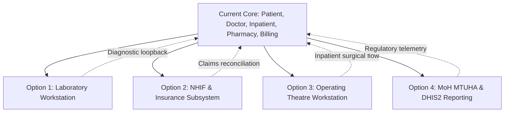

# AfyaNova EHR/HIMS — Next Implementation Phases & Roadmap

This document outlines the four next high-value architectural modules proposed for **AfyaNova v3**, detailing their business value, domain models, workflow integrations, and technical deliverables.

---

## Current Platform State (Completed Core Modules)

| Module / Domain | Status | Key Capabilities |
| :--- | :--- | :--- |
| **Multi-Tenancy & Identity** | ✅ Production Ready | Strict tenant data isolation, RBAC with role scopes, ULID keys, audit logs. |
| **Master Patient Index (MPI)** | ✅ Production Ready | Universal patient demographics, NIDA validation, MRN generation, blood groups, allergy alerts. |
| **Live Queue & Scheduling** | ✅ Production Ready | Multi-point triage routing, ticket prioritization (Normal / Urgent / Emergency), appointments calendar. |
| **Doctor Clinical Workstation** | ✅ Production Ready | Consultation workflow, SOAP charting, vital signs telemetry, ICD-10 diagnostic coding, Rx ordering. |
| **Billing & Cashier Till** | ✅ Production Ready | Shift reconciliation, double-entry financial line items, prepaid consultation/pharmacy invoice locks. |
| **Pharmacy & Inventory** | ✅ Production Ready | FEFO batch tracking, expiry monitoring, stock adjustments, immutable stock movements ledger. |
| **Inpatient Ward & Bed Mgmt** | ✅ Production Ready | Visual bed map, ward census, admissions, bed transfers, step-down care, and discharge registry. |

---

## Proposed Next Modules

---

## 🔬 Option 1: Laboratory Diagnostic & Pathology Workstation (`App\Domains\Laboratory`)

### 1. Overview & Business Value
Completes the clinical diagnostic loop by giving laboratory technicians, phlebotomists, and pathologists a dedicated workstation to process investigations ordered by doctors during OPD/IPD consultations.

### 2. Key Workflow & User Journeys
1. **Phlebotomy & Sample Collection**:
   - Lab queue displays ordered tests (*Full Blood Picture, Malaria mRDT, Liver Function, Serum Creatinine*).
   - Generates unique Accession Numbers & Barcode identifiers (`LAB-2026-XXXX`).
   - Records sample collection timestamp, container type (EDTA, Serum Gel, Citrate), and phlebotomist.
2. **Analyzer Worklist & Results Entry**:
   - Technicians input numerical or qualitative results.
   - Built-in reference ranges categorized by patient biological sex and age brackets.
   - Automatic calculation of panic/critical flags:
     - 🔴 **Critical High / Low** (triggers high-priority doctor notification)
     - 🟡 **Abnormal** (out of standard biological reference range)
     - 🟢 **Normal**
3. **Pathologist Verification & Electronic Sign-off**:
   - Senior Pathologist verifies results before release.
   - Instant live sync into the Doctor's **Clinical SOAP Chart** and patient timeline.
4. **Billing Synchronization**:
   - Test item fees automatically linked to the patient's billing invoice (or NHIF claim).

### 3. Proposed Database Architecture
* `lab_tests`: Test catalogue (code, name, department, turnaround time, standard fee).
* `lab_test_ranges`: Gender and age-stratified reference boundaries (min, max, critical min, critical max, unit).
* `lab_orders`: Clinical order instance linked to `encounter_id` and `patient_id`.
* `lab_specimens`: Physical sample tracking (accession number, sample type, collection time, collector ID).
* `lab_results`: Numerical/text results, reference range snapshot, abnormal flags, performed by, verified by.

---

## 🛡️ Option 2: NHIF & Health Insurance Claims Subsystem (`App\Domains\Insurance`)

### 1. Overview & Business Value
Provides full operational automation for Tanzanian hospitals operating under the **National Health Insurance Fund (NHIF)** and private HMOs (Jubilee, Strategis, Resolution, AAR, Britam, Microhealth).

### 2. Key Workflow & User Journeys
1. **Insurance Eligibility & Biometric Check**:
   - Verifies policy validity, membership number, dependent code, and biometric auth flags.
   - Pre-authorization tracking for specialized treatments and admissions (TAR / Prior Approvals).
2. **Dynamic Tariff Switcher**:
   - Switches pricing engine dynamically between standard Cash Fee Schedule and NHIF Package Tariff.
   - Automatic co-pay and non-covered exclusions management (e.g. specialized branded drugs not in NHIF formulary).
3. **Claim Form Generation & Itemization**:
   - Generates standard NHIF Claim Forms (Form 2A / 2B) with diagnostic ICD-10 codes, procedure codes, and consultation fees.
4. **Claim Batch Reconciliation**:
   - Batch claims generation for electronic or monthly submission.
   - Dispute and query tracking (Status: *Draft*, *Submitted*, *Vetted*, *Approved*, *Queried*, *Deducted*, *Paid*).

### 3. Proposed Database Architecture
* `insurance_providers`: Insurer master record (NHIF, Jubilee, Strategis).
* `insurance_schemes`: Specific coverage packages (e.g. NHIF National, NHIF Standard, Corporate Gold).
* `insurance_tariffs`: Negotiated rates for consultations, beds, procedures, and drugs.
* `insurance_policies`: Patient policy records (card number, principal member, validity dates).
* `insurance_claims`: Generated claim header with pre-auth code, total claimed amount, status.
* `insurance_claim_items`: Itemized line items mapped to insurance code dictionaries.

---

## 🏥 Option 3: Clinical Procedures & Surgical Workstation (`App\Domains\Procedure`)

### 1. Overview & Business Value
Coordinates clinical procedures and interventions across Tanzanian facility tiers:
1. **Tier 1 (Dispensary / OPD Level)**: Dressing & Minor Procedure Desk (*Chumba cha Vidonda na Sindano*) managed by Nurses, Clinical Officers, and Medical Officers (wound cleaning/dressing, suturing, abscess I&D, catheterization, cannulation, circumcision, foreign body removal) with automatic consumable inventory deduction and POS/NHIF billing.
2. **Tier 2 (Hospital / Theatre Level)**: Major Operating Theatre (OT) suite and table scheduling, WHO Surgical Safety Checklists (*Sign-In, Time-Out, Sign-Out*), intra-operative surgical and anesthesia logging, and PACU Aldrete recovery telemetry.

### 2. Key Workflow & User Journeys
1. **Dressing Room & Minor Procedure Desk (Tier 1 — Dispensary / OPD)**:
   - Clinical Orders from Doctors / COs route directly to the Dressing Room worklist.
   - Nurse/CO records wound condition (Clean, Contaminated, Purulent), procedure technique, and follow-up return dates.
   - **Automatic Stock Deduction**: Logging consumables (sterile gauze, surgical gloves, povidone-iodine, lignocaine, sutures) triggers atomic `StockMovement` deductions from dispensary inventory.
   - **1-Click Billing**: Automatically itemizes procedure fees on Cash invoices or NHIF claim forms.
2. **Operating Theatre Scheduling & Table Booking (Tier 2 — Hospital)**:
   - Visual calendar of surgical suites (Major Theatre 1, Minor Theatre 2, Maternity Suite).
   - Prevents overlapping bookings of surgical teams and equipment.
3. **WHO Surgical Safety Checklist (Tier 2)**:
   - Electronic Sign-In (before induction of anesthesia).
   - Electronic Time-Out (before skin incision).
   - Electronic Sign-Out (before patient leaves operating room).
4. **Intra-Operative Documentation & Anesthesia (Tier 2)**:
   - Primary Surgeon, Assistant Surgeons, Anesthetist, Scrub Nurse, and Circulating Nurse logging.
   - Surgical procedure code, incision type, surgical findings, implant serial numbers, blood loss telemetry.
5. **PACU Recovery Telemetry (Tier 2)**:
   - Post-Anesthesia Care Unit vitals recording (Aldrete Score for discharge readiness $\ge 9/10$).
   - Bed transfer back to surgical inpatient ward.

### 3. Proposed Database Architecture
* `procedure_catalogs`: Catalog of dressing, minor surgery, and major surgical procedures with standard fees.
* `procedure_orders`: Clinician order instance linked to `encounter_id` and `patient_id`.
* `procedure_executions`: Clinical execution notes, wound condition, anesthesia, and follow-up instructions.
* `procedure_consumables_used`: Itemized tracking of consumables deducted from inventory and billed.
* `operating_suites`: Operating rooms master (Major, Minor, Obstetric).
* `surgical_bookings`: Scheduled theatre slots, surgical team assignments, urgency.
* `who_surgical_checklists`: WHO checklist audit entries (Sign-In, Time-Out, Sign-Out).
* `pacu_recovery_records`: Aldrete scores and recovery vitals.

---

## 📊 Option 4: MoH MTUHA, DHIS2 & Hospital Intelligence Analytics (`App\Domains\Reports`)

### 1. Overview & Business Value
Automates regulatory health reporting to the **Tanzania Ministry of Health (MoH)** via **MTUHA** (*Mfumo wa Taarifa za Uendeshaji wa Huduma za Afya*) and **DHIS2**, alongside executive financial and clinical KPI intelligence.

### 2. Key Workflow & User Journeys
1. **Automated MTUHA Monthly Registers**:
   - MTUHA Kitabu cha 1 (Outpatient Register / OPD Morbidity).
   - MTUHA Kitabu cha 2 (Inpatient Census & Bed Occupancy).
   - MTUHA Kitabu cha 5 (Maternal & Child Health).
2. **Epidemiological Disease Surveillance**:
   - Top 10 Outpatient Diagnoses (Malaria, URTI, Pneumonia, Hypertension, Diabetes).
   - Top 10 Inpatient Morbidity & Mortality rates.
   - Notifiable disease alert system (Cholera, Typhoid, Measles).
3. **Financial & Executive Intelligence**:
   - Daily, monthly, and annual revenue collection by service center (Pharmacy, Lab, Radiology, Beds, Consultation).
   - Cash vs. Insurance revenue split.
   - Pharmacoeconomics: Fast-moving drugs, wastage due to expiry, inventory valuation.

### 3. Proposed Database Architecture
* `report_definitions`: Configurable report templates with metric queries.
* `report_snapshots`: Pre-aggregated periodic statistics for high-performance dashboards.
* `dhis2_data_elements`: MoH DHIS2 mapped indicators and data values.

---

## Summary Comparison & Recommendation

| Criteria | Option 1: Laboratory | Option 2: NHIF / Insurance | Option 3: Operating Theatre | Option 4: MTUHA / Analytics |
| :--- | :--- | :--- | :--- | :--- |
| **Immediate Clinical Impact** | ⭐⭐⭐⭐⭐ Highest | ⭐⭐⭐⭐ High | ⭐⭐⭐ Medium | ⭐⭐⭐ Medium |
| **Dependencies Needed** | Doctor Consultation (Done) | Billing Subsystem (Done) | Inpatient Beds (Done) | All Modules (Done) |
| **Workflow Completion** | Diagnostic loopback to SOAP | Revenue reimbursement | Surgical admissions | Ministry compliance |
| **Recommended Sequence** | **Phase 1** | **Phase 2** | **Phase 3** | **Phase 4** |

### Next Step Recommendation
Proceed with **Option 1: Laboratory Diagnostic & Pathology Workstation** to complete the clinical diagnostic lifecycle between doctors, sample collection, laboratory analysis, and cashier billing.
